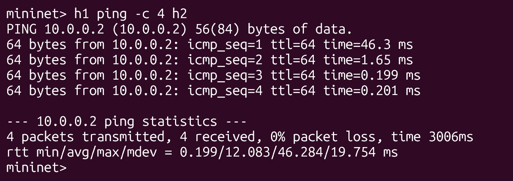
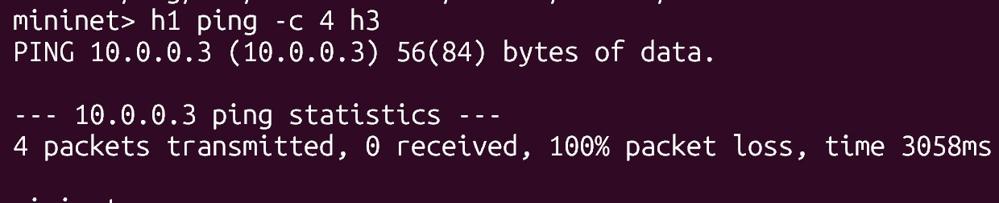
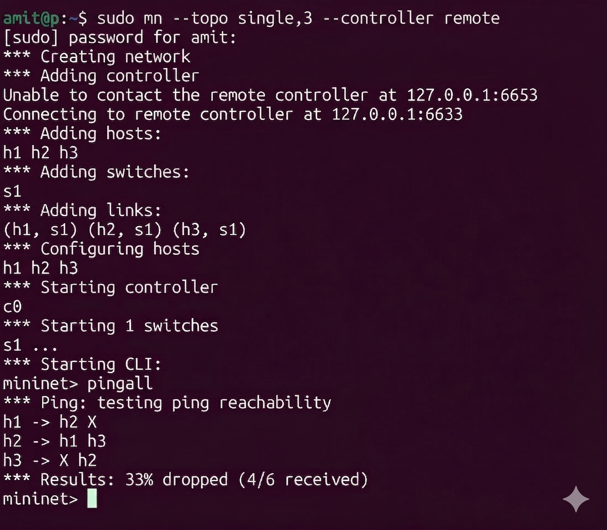
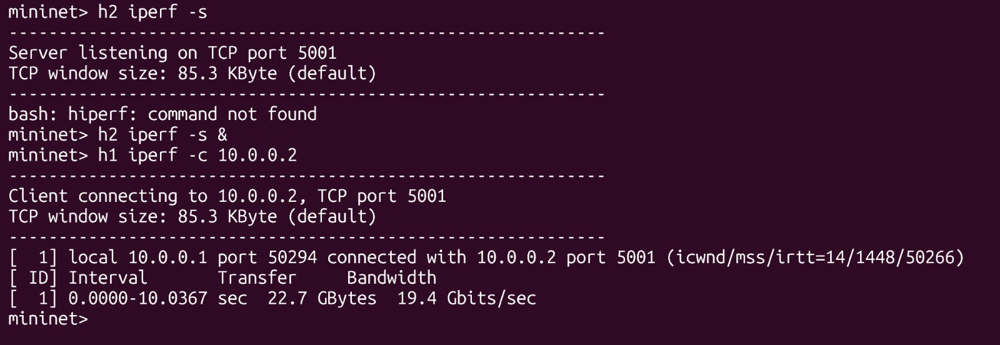
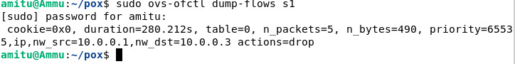
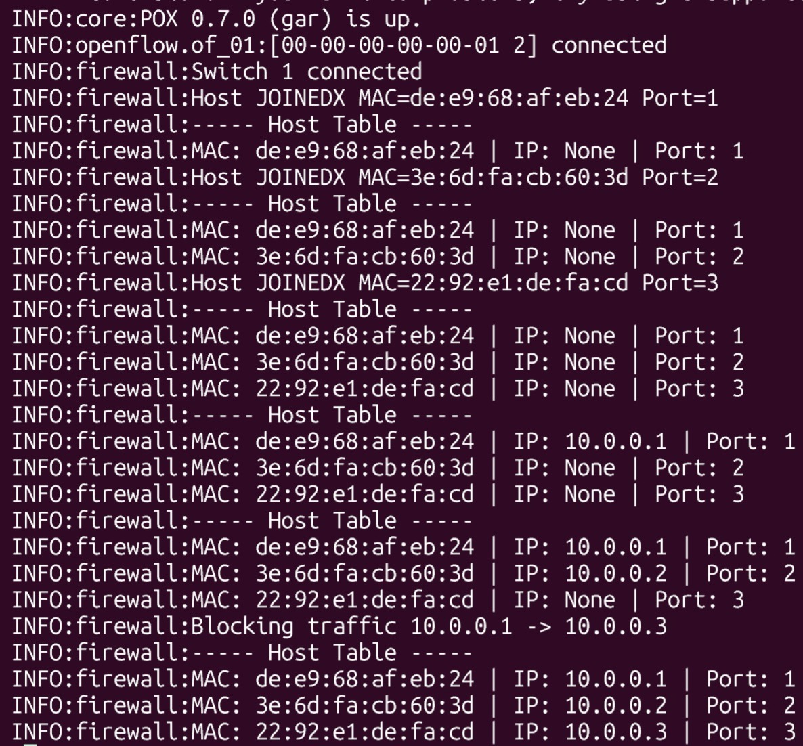

# SDN Firewall and Host Discovery using POX and Mininet

---

## 📌 Problem Statement
The goal of this project is to implement a Software Defined Networking (SDN) solution using Mininet and a POX controller.  
The project demonstrates:
- Controller–switch interaction  
- Flow rule design (match–action)  
- Network behavior analysis  

---

## 🚀 Features
- Learning Switch (MAC → Port mapping)  
- Firewall (Blocks traffic from h1 to h3)  
- Host Discovery (MAC, IP, Port tracking)  
- Dynamic Updates (Host join + IP updates)  
- Flow Rule Installation using OpenFlow  
- Logging and Monitoring  

---

## 🌐 Topology

```
h1 --- s1 --- h2
        |
        h3
```

---

## ⚙️ Setup and Execution

### Step 1: Start POX Controller
```
cd ~/pox
./pox.py firewall
```

### Step 2: Start Mininet
```
sudo mn --topo single,3 --controller remote
```

---

## 🧪 Test Scenarios

### ✅ Allowed Traffic
```
h1 ping -c 4 h2
```



---

### 🚫 Blocked Traffic (Firewall)
```
h1 ping -c 4 h3
```



---

## 📊 Performance Analysis

### 🔹 Latency (Ping)
```
pingall
```



---

### 🔹 Throughput (iperf)
```
h2 iperf -s &
h1 iperf -c 10.0.0.2
```



---

## 🔍 Flow Table Analysis

### Command:
```
sudo ovs-ofctl dump-flows s1
```

### Explanation:
- High priority rule → Firewall (DROP)  
- Lower priority rules → Forwarding (OUTPUT)  



---

## 🧠 Dynamic Host Discovery

### Trigger discovery
```
h1 ping -c 1 h2
```

### Controller Logs Example
```
Host JOINED: MAC=xx Port=1
MAC: xx | IP: 10.0.0.1 | Port: 1
```



---

## ⚡ Key Concepts Used

- SDN Architecture (Control Plane vs Data Plane)  
- OpenFlow Protocol  
- PacketIn Event Handling  
- Match–Action Flow Rules  
- Firewall Logic Implementation  
- Dynamic Host Discovery  

---

## ✅ Conclusion

This project successfully demonstrates:
- Dynamic flow rule installation  
- Firewall-based traffic control  
- Host discovery with real-time updates  
- Performance measurement using ping and iperf  

---

## 📂 Project Structure

```
project/
 ├── firewall.py
 ├── README.md
 └── screenshots/
      ├── allowed.jpeg
      ├── blocked.jpeg
      ├── ping.jpeg
      ├── iperf.jpeg
        ├── flow.jpeg
      └── hosts.jpeg
```
